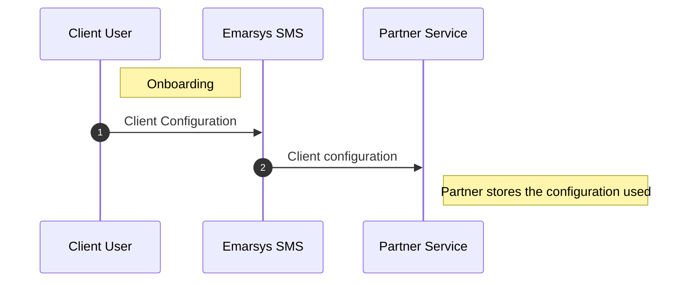
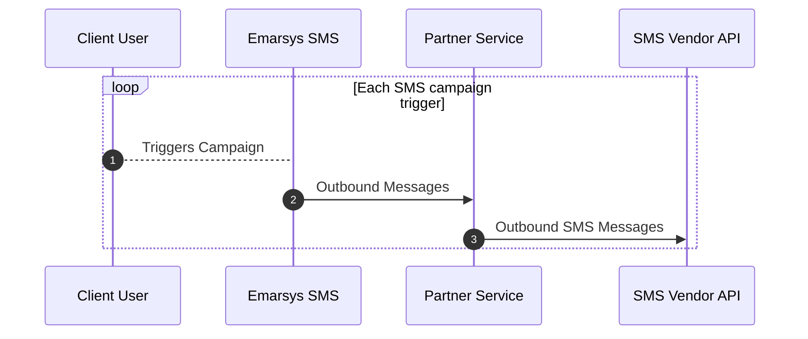
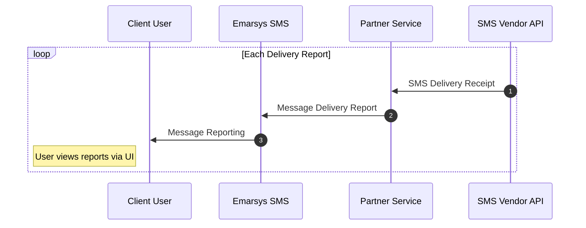
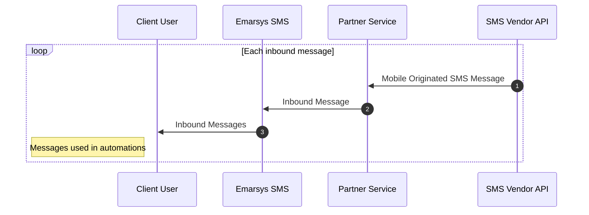

# Emarsys SMS Partner API Documentation

SAP Emarsys empowers marketers around the world to create a truly personalized omnichannel experiences that delivers business outcomes. The Emarsys SMS Partner API allows partners to integrate onto the Emarsys SMS channel. The Partner API uses a RESTful approach.

## API Specification

The API specification has been created using OpenAPI 3.0.3. It is available to be viewed and exported using the links below:

- [Partner Service Specification](../partner-service.yaml)
- [Partner Callbacks Specification](../partner-callbacks.yaml)

The current functionality supported is:

- [Self-service on-boarding for the client end user.](#client-onboarding).
- [Sending SMS messages triggered by the Emarsys platform.](#outbound-messages)
- [Recording delivery reports of sent messages.](#delivery-reports)
- [Ingesting inbound SMS messages.](#inbound-messages)

## Glossary

| Term | Definition |
| ---- | --------- |
| Client | This is the client user utilising the Partner service for the SMS channel. |
| Client ID | Ths is the ID used to reference the client user's integration with the Partner service. It is generated when the client user completes the onboarding |

---
## Setup

This section describes the steps required to use the SAP Emarsys SMS Partner API.

### Partner Onboarding

To onboard we require:

- Display name of the partner
- Base URL for the partner service
- Supported countries (ideally a list of ISO-3 country codes)
- Partner-managed OAuth service host and OAuth Client ID
- Custom Fields for the self-service customer on-boarding
  - ##### Field properties:
    | Property        | Description                                            |
        | --------------- | ------------------------------------------------------ |
    | Field Name (ID) | Uniquely identifies the field                          |
    | Type            | Either `text`, `select` or `password`                  |
    | Label           | Label shown during on-boarding                         |
    | Allowed Values  | A list of possible values to offer in the select field |
  - ##### Example custom fields:
    | ID       | Type       | Label   | Allowed Values  |
        | -------- | ---------- | ------- | --------------- |
    | `apiKey` | `password` | API Key | N/A             |
    | `region` | `select`   | Region  | `Asia`,`Europe` |
- Features enabled:
  - Whether your platform supports inbound messages
- Contact details (we will contact you in case of an issue):
  - Phone number
  - Email

And we subsequently provide:

- Confirmation of setup completion on an environment (staging / production)
- Emarsys SMS OAuth details (host, endpoints, client ID) to verify requests

### Authorization

Requests sent by Emarsys will have an OAuth 2 token. This token should be validated by the Partner service. Emarsys will validate a Partner's requests using the provided (external) OAuth service and OAuth client ID

| URI                                                       | Description                                                      |
| --------------------------------------------------------- | ---------------------------------------------------------------- |
| `https://smsemarsys.accounts.ondemand.com`              | SAP token issuer host                                            |
| `https://smsemarsys.accounts.ondemand.com/oauth2/token` | SAP IAS access token endpoint                                    |
| `https://smsemarsys.accounts.ondemand.com/oauth2/certs` | SAP IAS JSON Web Key Set (JWKS) certificate information endpoint |

---

## Workflows

Below are the supported workflows of a partner service

| Workflow          | Supported           | Required            |
| ----------------- | ------------------- | ------------------- |
| Client onboarding | <center>✅</center> | <center>✅</center> |
| Outbound messages | <center>✅</center> | <center>✅</center> |
| Inbound Messages  | <center>✅</center> | <center>❌</center> |

### Client Onboarding



1. Client user (marketer) will use the self-onboarding UI to setup their SMS channel. During this process they will select the partner and provide their values required in the custom fields.
2. The SMS service will on-board the client, generate a unique client ID (to reference them) and forward the client configuration (the values entered in the custom fields) to the Partner service.


<!-- theme: warning -->
> #### Attention!
>
> The Partner service must store the client configuration as it is it not stored within the SMS service.

---

#### Endpoints

A partner service requires the following endpoints to support client onboarding:

- ##### [Create/Update Client Configuration](../partner-api/partner-service.yaml/paths/~1clients~1{clientId}~1configuration/put)

##### Request Schema:

```yaml json_schema
$ref: '../partner-service.yaml#/components/schemas/CreateOrUpdateClientConfigurationRequest'
```

##### Response Schema:

```yaml json_schema
$ref: '../partner-service.yaml#/components/schemas/CreateOrUpdateClientConfigurationResponse'
```

---

- ##### [Get Client Configuration](../partner-api/partner-service.yaml/paths/~1clients~1{clientId}~1configuration/get)

##### Response Schema:

```yaml json_schema
$ref: '../partner-service.yaml#/components/schemas/GetClientConfigurationResponse'
```

---

- ##### [Delete Client Configuration](../partner-api/partner-service.yaml/paths/~1clients~1{clientId}~1configuration/delete)

---

### Outbound Messaging and Reporting


#### Outbound Messages



1. The client user triggers an SMS campaign launch. This can be either manually or using some automation.
2. The Emarsys SMS service will generate the messages for the launch and send them to the Partner Service
3. The Partner service will then send the messages (on behalf of the client user) via the Partner/Vendor SMS API

- ##### [Create Outbound Message Batch](../partner-api/partner-service.yaml/paths/~1clients~1{clientId}~1messages/post)
  - Request Payload
    ```yaml json_schema
    $ref: '../partner-service.yaml#/components/schemas/OutboundMessageBatch'
    ```

#### Delivery Reports

Delivery reports are communicated via a callback to Emarsys SMS:



1. The SMS vendor API receives a delivery receipt from their operator and sends it to the Partner service.
2. The Partner service receives the delivery receipt, categorises it based on the type of receipt (schema below) and sends it to the [Emarsys SMS delivery receipt callback endpoint](../partner-api/partner-callbacks.yaml/paths/~1clients~1{clientId}~1deliveryReports/post).
3. Emarsys SMS will aggregate the delivery report information for a given SMS launch to be used by the client user.

---

- ##### [Create Delivery Report Batch](../partner-api/partner-callbacks.yaml/paths/~1clients~1{clientId}~1deliveryReports/post)

  ***

  - ##### Request
    ***
    - Delivery Report:
      ```yaml json_schema
      $ref: '../partner-callbacks.yaml#/components/schemas/DeliveryReport'
      ```
      ***
  - ##### Response
    ***
    - Delivery Report Error:
      ```yaml json_schema
      $ref: '../partner-callbacks.yaml#/components/schemas/DeliveryReportError'
      ```
      ***
    - Invalid Format Error Batch Response Payload:
      ```yaml json_schema
      $ref: '../common.yaml#/components/schemas/InvalidFormatErrorBatch'
      ```
      ***

---

### Inbound Messages



1. Mobile originated SMS messages are received by the SMS vendor and sent to the Partner service.
2. The Partner service receives the mobile originated SMS messages and sends them to the [Emarsys SMS inbound messages callback endpoint](../partner-api/partner-callbacks.yaml/paths/~1clients~1{clientId}~1inboundMessages/post).
3. The inbound messages are used by the client user via the triggers they have set up within the Emarsys SMS channel.

- ##### [Create Inbound Messages Batch](../partner-api/partner-callbacks.yaml/paths/~1clients~1{clientId}~1inboundMessages/post)
  - Inbound Message Batch Request Payload:
    ```yaml json_schema
    $ref: '../partner-callbacks.yaml#/components/schemas/InboundMessageBatch'
    ```
  - Invalid Format Error Batch Response Payload:
    ```yaml json_schema
    $ref: '../common.yaml#/components/schemas/InvalidFormatErrorBatch'
    ```

---
