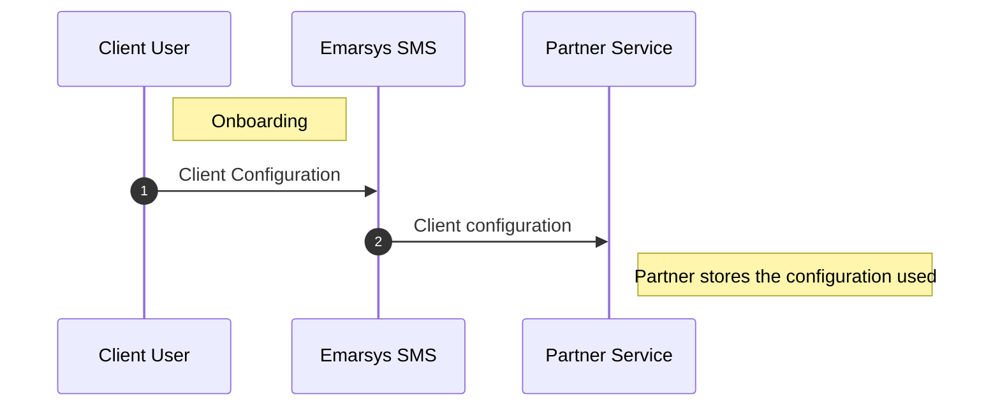
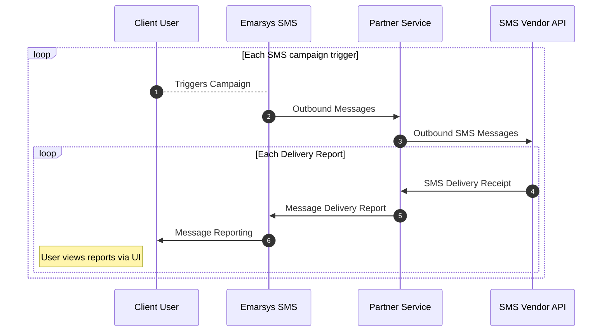
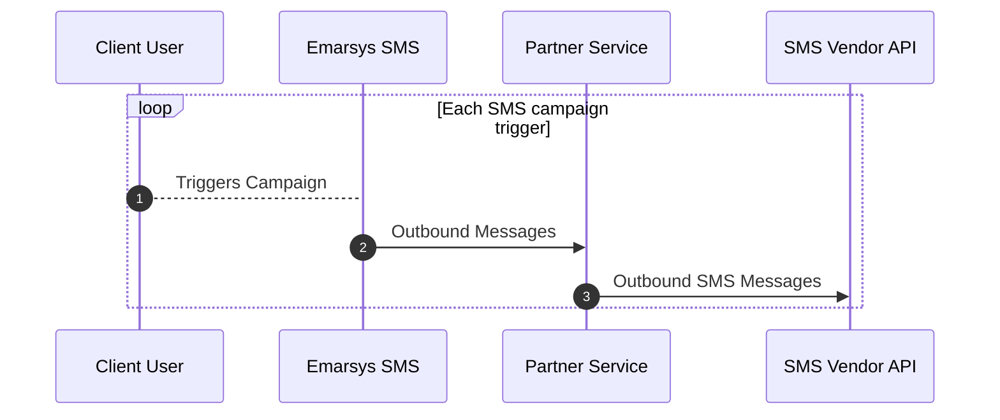
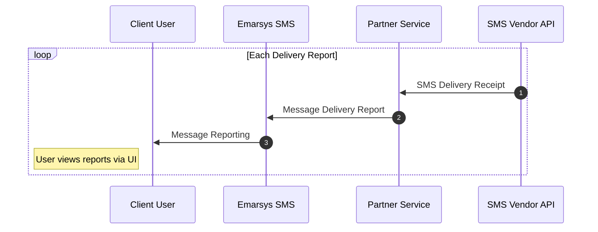
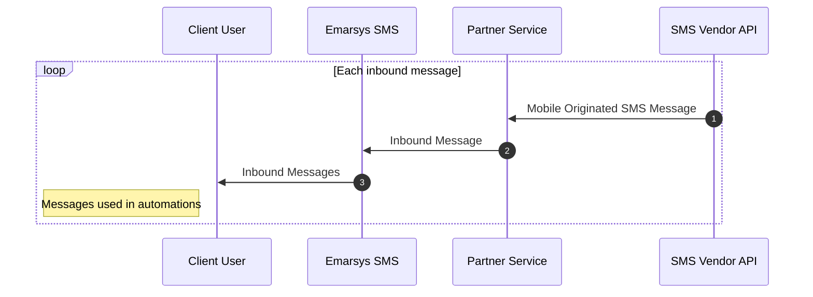

# Instructions

SAP Emarsys empowers marketers around the world to create a truly personalized omnichannel experiences that delivers business outcomes. The Emarsys SMS Partner API allows partners to integrate onto the Emarsys SMS channel. The Partner API is [RESTful](https://todo-link.com).

## API Specification

The API specification has been created using OpenAPI 3.0.3. It is available to be viewed and exported using the links below:

- [Partner Service Specification](../partner-service.yaml)
- [Partner Callbacks Specification](../partner-callbacks.yaml)

The current functionality supported is:

- [Self-service on-boarding for the client end user.](#client-onboarding).
- [Sending SMS messages triggered by the Emarsys platform.](#outbound-messages)
- [Recording delivery reports of sent messages.](#outbound-messages)
- [Ingesting inbound SMS messages.](#inbound-messages)

## Glossary

| Term | Definition |
| ---- | --------- |
| Client | This is the client user utilising the Partner service for the SMS channel. |
| Client ID | Ths is the ID used to reference the client user's integration with the Partner service. It is generated when the client user completes the onboarding |
---
## Setup

This section describes the steps required to use the SAP Emarsys SMS Partner API.

### Partner Onboarding

To onboard we require:

- Display name of the partner
- Base URL for the partner service
- Supported countries (ideally a list of ISO-3 country codes)
- Custom Fields for the self-service customer on-boarding
  - ##### Field properties:
    | Property        | Description                                            |
    | --------------- | ------------------------------------------------------ |
    | Field Name (ID) | Uniquely identifies the field                          |
    | Type            | Either `text`, `select` or `password`                  |
    | Label           | Label shown during on-boarding                         |
    | Allowed Values  | A list of possible values to offer in the select field |
  - ##### Example custom fields:
    | ID       | Type       | Label   | Allowed Values  |
    | -------- | ---------- | ------- | --------------- |
    | `apiKey` | `password` | API Key | N/A             |
    | `region` | `select`   | Region  | `Asia`,`Europe` |
- Features enabled:
  - Whether your platform supports inbound messages

And we subsequently provide:

- Emarsys SMS Oauth client ID to verify the Emarsys SMS channel requests
- Callback Oauth client ID and secret to sign callback requests

### Authorization

Requests sent and received by Emarsys will have an OAuth 2 token. This token should be validated by the Partner service.

| URI                                                       | Description                                                      |
| --------------------------------------------------------- | ---------------------------------------------------------------- |
| `https://anrjzyscq.accounts400.ondemand.com`              | SAP token issuer host                                            |
| `https://anrjzyscq.accounts400.ondemand.com/oauth2/token` | SAP IAS access token endpoint                                    |
| `https://anrjzyscq.accounts400.ondemand.com/oauth2/certs` | SAP IAS JSON Web Key Set (JWKS) certificate information endpoint |

---

## Workflows

Below are the supported workflows of a partner service

| Workflow          | Required            |
| ----------------- | ------------------- |
| Client onboarding | <center>✅</center> |
| Outbound messages | <center>✅</center> |
| Inbound Messages  | <center>❌</center> |

### Client Onboarding



A partner service requires the following endpoints to support client onboarding:

---

- #### [Create/Update Client Config](../partner-service.yaml/paths/~1clients~1{clientId}~1configuration/get)

##### Request Schema:

```yaml json_schema
$ref: '../partner-service.yaml#/components/schemas/CreateOrUpdateClientConfigurationRequest'
```

##### Response Schema:

```yaml json_schema
$ref: '../partner-service.yaml#/components/schemas/CreateOrUpdateClientConfigurationResponse'
```

---

- [Get Client Config](../partner-service.yaml/paths/~1clients~1{clientId}~1configuration/get)

##### Response Schema:

```yaml json_schema
$ref: '../partner-service.yaml#/components/schemas/GetClientConfigurationResponse'
```

---

- [Delete Client Config](../partner-service.yaml/paths/~1clients~1{clientId}~1configuration/delete)

---

### Outbound Messaging and Reporting

#### Overview



#### Outbound Messages



- [Create Outbound Message Batch](../partner-service.yaml/paths/~1clients~1{clientId}~1messages/post)
  - Request Payload
    ```yaml json_schema
    $ref: '../partner-service.yaml#/components/schemas/OutboundMessageBatch'
    ```

#### Delivery Reports

Delivery reports are communicated via a callback to Emarsys SMS:



---

- [Create Delivery Report Batch](../partner-callbacks.yaml/paths/~1clients~1{clientId}~1deliveryReports)

  ***

  - ##### Request
    ***
    - Delivery Report:
      ```yaml json_schema
      $ref: '../partner-callbacks.yaml#/components/schemas/DeliveryReport'
      ```
      ***
  - ##### Response
    ***
    - Delivery Report Error:
      ```yaml json_schema
      $ref: '../partner-callbacks.yaml#/components/schemas/DeliveryReportError'
      ```
      ***
    - Invalid Format Error Batch Response Payload:
      ```yaml json_schema
      $ref: '../common.yaml#/components/schemas/InvalidFormatErrorBatch'
      ```
      ***

---

### Inbound Messages



- [Create Inbound Messages Batch](../partner-callbacks.yaml/paths/~1clients~1{clientId}~1inboundMessages)
  - Inbound Message Batch Request Payload:
    ```yaml json_schema
    $ref: '../partner-callbacks.yaml#/components/schemas/InboundMessageBatch'
    ```
  - Invalid Format Error Batch Response Payload:
    ```yaml json_schema
    $ref: '../common.yaml#/components/schemas/InvalidFormatErrorBatch'
    ```

---
